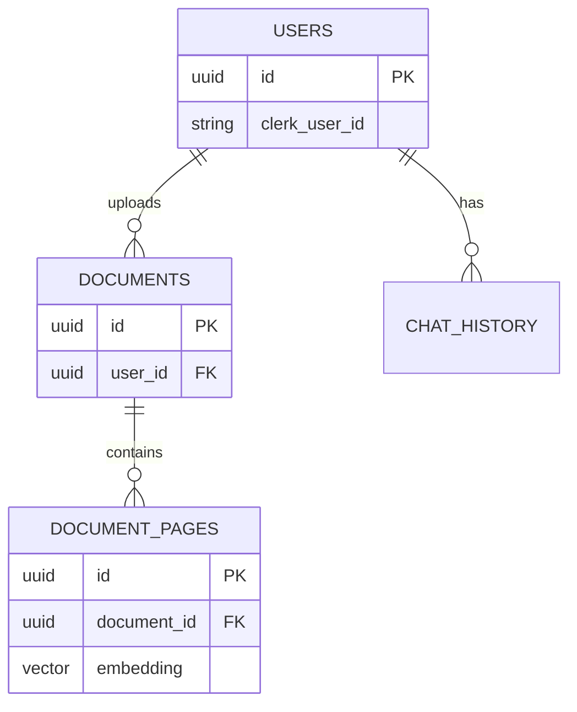

# 🗄️ Database Schema

Documentation of the Supabase PostgreSQL database structure.

---

## Overview

The database uses PostgreSQL with the `pgvector` extension for storing vector embeddings. It is managed via Supabase.

**Tables:**
- `users`: Stores user profiles linked to Clerk.
- `documents`: Metadata for uploaded files.
- `document_pages`: Text chunks and vector embeddings.
- `chat_history`: Stores Q&A sessions.

---

## Tables

### 1. `users`
Stores user identity.
| Column | Type | Description |
|--------|------|-------------|
| `id` | UUID (PK) | Internal ID |
| `clerk_user_id` | TEXT (Unique) | ID from Clerk Auth |
| `email` | TEXT | User email |
| `username` | TEXT | Display name |
| `created_at` | TIMESTAMP | Creation date |

### 2. `documents`
Stores file metadata.
| Column | Type | Description |
|--------|------|-------------|
| `id` | UUID (PK) | Document ID |
| `user_id` | UUID (FK) | Owner (`users.id`) |
| `filename` | TEXT | Stored filename |
| `original_filename` | TEXT | User's filename |
| `file_size` | BIGINT | Size in bytes |
| `r2_key` | TEXT | Key in Cloudflare R2 |
| `r2_url` | TEXT | Public/Private URL |
| `upload_status` | TEXT | 'pending', 'processed', 'error' |

### 3. `document_pages`
Stores the actual content for AI analysis.
| Column | Type | Description |
|--------|------|-------------|
| `id` | UUID (PK) | Chunk ID |
| `document_id` | UUID (FK) | Parent Document |
| `page_number` | INTEGER | Page number in PDF |
| `content` | TEXT | Extracted text content |
| `embedding` | VECTOR(384) | 384-dim vector (for Gemini/MiniLM) |

### 4. `chat_history`
Stores conversation logs.
| Column | Type | Description |
|--------|------|-------------|
| `id` | UUID (PK) | Message ID |
| `user_id` | UUID (FK) | Owner |
| `session_id` | TEXT | Grouping ID for chats |
| `message` | TEXT | User's question |
| `response` | TEXT | AI's answer |
| `sources` | JSONB | List of source docs used |

---

## Relationships (ERD)



---

## Security (RLS)

**Row-Level Security (RLS)** is enabled on ALL tables.

- **Policy:** Users can ONLY select, insert, update, or delete rows where `user_id` matches their authenticated ID.
- **Implementation:**
  ```sql
  create policy "User can see own data"
  on tables
  for select
  using (auth.uid() = clerk_user_id);
  ```

---

## Performance Indexes

- `idx_documents_user_id`: Faster retrieval of user's file list.
- `idx_document_pages_document_id`: Faster retrieval of pages for a doc.
- `hnsw` index on `embedding`: Enables fast approximate nearest neighbor search (vector search).
